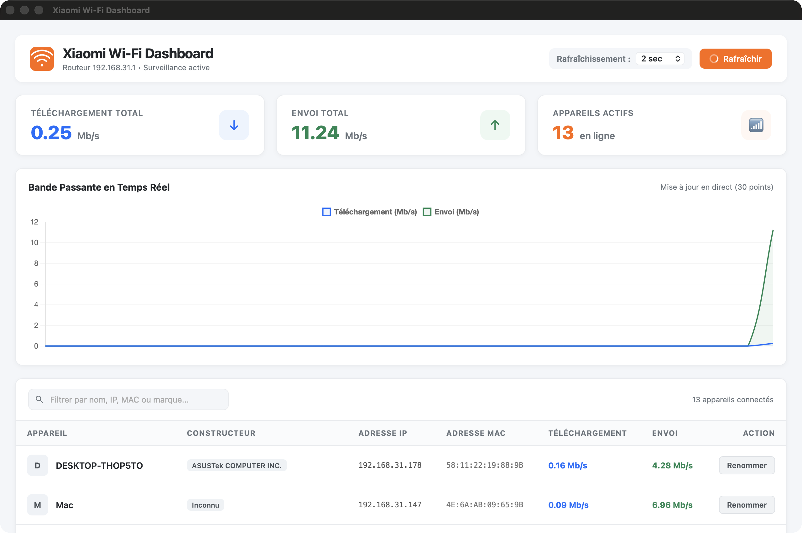

<div align="center">
  
  <h1>Xiaomi Router Network Usage & Dashboard</h1>
  <p><strong>Application moderne et performante de surveillance du réseau en temps réel pour routeurs Xiaomi (Mi Wi-Fi).</strong></p>

  <p>
    
    
    
    
    
  </p>
</div>

---

## 📸 Aperçu de l'interface

<p align="center">
  
</p>

---

## ✨ Fonctionnalités clés

- 📊 **Graphique de bande passante en direct** : Suivi fluide et instantané des débits montants (upload) et descendants (download) propulsé par [Chart.js](https://www.chartjs.org/).
- ⏱️ **Fréquence de rafraîchissement personnalisable** : Choisissez la cadence de mise à jour (1s, 2s, 5s ou 10s) selon vos besoins.
- 📱 **Inventaire intelligent des appareils** :
  - Liste exhaustive de tous les équipements connectés (Wi-Fi et Ethernet).
  - Détection automatique des adresses MAC, adresses IP et vitesses instantanées de chaque client.
  - Résolution automatique du constructeur via la base officielle IEEE OUI (ex: *Apple, Samsung, ASUSTeK, Espressif...*).
  - Filtrage et recherche instantanée par nom, marque, IP ou MAC.
- 🏷️ **Gestion d'alias personnalisés** : Renommez facilement vos équipements directement depuis l'interface (*ex: "MacBook Pro de Saber", "Console Salon"*), persistés automatiquement dans un fichier local.
- 🖥️ **Expérience native de bureau** :
  - Fenêtre applicative native ultralégère avec [pywebview](https://pywebview.flowrl.com/) (WebKit sur macOS, WebView2 sur Windows, GTK WebKit sur Linux).
  - Basculement automatique en mode serveur Web (`http://localhost:5000`) si aucun environnement graphique n'est détecté.
  - Option serveur dédiée pour une exécution headless (sur un serveur domotique, Raspberry Pi, NAS, etc.).
- 🎨 **Icônes natives intégrées** : Prise en charge complète des icônes d'application sur tous les systèmes (`.icns` macOS, `.ico` Windows, `.png` Linux et favicon Web).
- 🔒 **Gestion sécurisée des identifiants** : Mot de passe et adresse IP isolés via `config.json` ou variables d'environnement (`.env`).

---

## ⚙️ Configuration initiale

1. Dupliquez le fichier d'exemple :
   ```bash
   cp config.example.json config.json
   ```

2. Renseignez l'adresse IP de votre routeur (par défaut `192.168.31.1`) et le mot de passe d'administration :
   ```json
   {
     "router_ip": "192.168.31.1",
     "router_password": "VOTRE_MOT_DE_PASSE"
   }
   ```

> 💡 **Alternative via variables d'environnement** :
> ```bash
> export ROUTER_IP="192.168.31.1"
> export ROUTER_PASSWORD="votre_mot_de_passe"
> ```

---

## 🚀 Lancement rapide

### Méthode 1 : Script tout-en-un

Le script `start.sh` détecte automatiquement si une version compilée existe ou initialise un environnement virtuel Python local :

```bash
./start.sh
```

### Méthode 2 : Lancement manuel via Python

1. **Créer et activer un environnement virtuel** :
   ```bash
   python3 -m venv .venv
   source .venv/bin/activate
   ```

2. **Installer les dépendances** :
   ```bash
   pip install -r requirements.txt
   ```

3. **Lancer l'application** :
   ```bash
   # Lancement standard avec fenêtre graphique
   python xiaomi_wifi_dashboard.py

   # Lancement en mode serveur web uniquement (http://localhost:5000)
   python xiaomi_wifi_dashboard.py --server

   # Consulter les options disponibles
   python xiaomi_wifi_dashboard.py --help
   ```

---

## 🔨 Compilation autonome (Build Local)

Le projet propose des scripts de compilation 100% autonomes et locaux utilisant [PyInstaller](https://pyinstaller.org/). Aucun compte cloud ni pipeline CI externe n'est requis.

### 🍎 macOS
```bash
./build_macos.sh
```
- Crée un environnement virtuel local si nécessaire.
- Compile un bundle natif instantané `dist/xiaomi_dashboard.app` avec l'icône haute résolution `.icns`.
- Génère un wrapper CLI exécutable `dist/xiaomi_dashboard`.
- Crée une archive prête à distribuer `dist/xiaomi-dashboard-macos-<arch>.zip`.

### 🐧 Linux
```bash
./build_linux.sh
```
- Génère l'exécutable autonome `dist/xiaomi_dashboard`.
- Produit l'archive `dist/xiaomi-dashboard-linux-<arch>.tar.gz` avec le fichier `.desktop` et l'icône.

### 🪟 Windows
```cmd
build_windows.bat
```
- Génère l'exécutable `dist/xiaomi_dashboard.exe` avec l'icône Windows `.ico`.
- Produit l'archive `dist/xiaomi-dashboard-windows-<arch>.zip`.

---

## 🧹 Nettoyage du projet

Pour supprimer les dossiers de compilation (`dist/`, `build/`, `*.spec`, caches Python) :

```bash
# Linux / macOS
./clean.sh

# Windows
clean.bat

# Multiplateforme
python clean.py

# Pour nettoyer également les fichiers locaux de config (config.json, alias) :
python clean.py --all
```

---

## 📁 Structure du projet

```
xiaomi-router-network-usage/
├── assets/                       # Icônes multiplateformes
│   ├── icon.icns                 # macOS (Retina 16x16 à 1024x1024)
│   ├── icon.ico                  # Windows (multi-résolutions)
│   └── icon.png                  # Linux / Master HD (1024x1024)
├── docs/
│   └── screenshots/              # Captures d'écran de l'application
│       └── dashboard.png
├── static/                       # Ressources statiques pour le serveur Web / GUI
│   ├── chart.min.js              # Librairie graphique Chart.js
│   ├── favicon.ico               # Favicon du serveur
│   ├── icon.png                  # Icône pour l'en-tête HTML
│   └── icon.svg                  # Vecteur SVG
├── build.py                      # Moteur de compilation multiplateforme
├── build_linux.sh                # Script de build Linux
├── build_macos.sh                # Script de build macOS
├── build_windows.bat             # Script de build Windows
├── clean.py                      # Script de nettoyage multiplateforme
├── clean.sh / clean.bat          # Scripts de nettoyage par OS
├── config.example.json           # Exemple de configuration routeur
├── requirements.txt              # Dépendances Python
├── start.sh                      # Lanceur universel intelligent
├── xiaomi-dashboard.desktop      # Raccourci d'application de bureau Linux
└── xiaomi_wifi_dashboard.py      # Code source principal (Backend Flask + GUI)
```

---

## 🛠️ Dépannage & FAQ

<details>
<summary><strong>Comment fonctionne l'authentification avec le routeur Xiaomi ?</strong></summary>

L'application interagit directement avec l'API LuCI du routeur Xiaomi. Elle récupère le `nonce` et le `deviceId` via `/cgi-bin/luci/web`, calcule l'empreinte SHA256 avec votre mot de passe et obtient un jeton de session `stok` officiel. Ce jeton est automatiquement renouvelé s'il expire.
</details>

<details>
<summary><strong>L'application est-elle compatible avec les routeurs sous OpenWrt nu ?</strong></summary>

Cette application est conçue pour le firmware d'origine **Xiaomi Mi WiFi** (basé sur un OpenWrt personnalisé avec l'API `/api/misystem/devicelist`). Elle fonctionne sur la majorité des routeurs Xiaomi et Redmi (AX3000, AX6000, AX9000, BE3600, BE7000, etc.).
</details>

<details>
<summary><strong>Avertissement macOS au premier lancement</strong></summary>

Comme l'application est compilée localement et non signée avec un certificat Apple Developer payant, macOS peut demander confirmation lors de la première ouverture. Pour l'ouvrir :
- Clic droit sur `xiaomi_dashboard.app` > **Ouvrir**.
- Ou dans le terminal : `xattr -cr dist/xiaomi_dashboard.app`.
</details>

---

## 📄 Licence

Ce projet est distribué sous licence libre **GPLv3**. Consultez le fichier [LICENSE](LICENSE) pour plus de détails.
